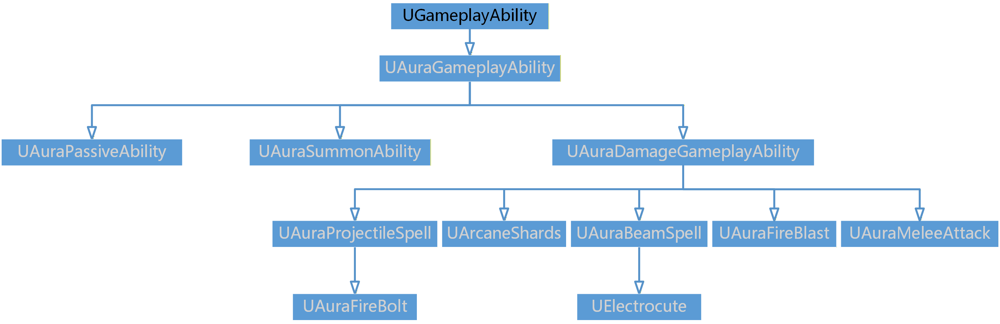

# ___Aura_demo___
基于UE5.2 GAS插件开发的 RPG 多人联机游戏

~~在 HUD 上，使用自定义模板实现了怪物沟边，利用 MVC 模型构建 UI 系统，包括人物属性界面以及技能树界面等，通过委托和事件机制完善了属性点、技能点的养成交互。
人物技能实现上 ，利用单例模式自定义 GameplayTag、 BlueprintFunctionLibrary 等全局类来管理标签和全局函数等。通过构建多种修饰器属性类型的 GE 和 AbilityTask 实现了多种技能；
在伤害数值计算上 ，通过 ModifierMagnitudeCalculation 和 ExecutionCalculation 实现了角色各属性的初始化和伤害的公式化计算等 ，涉及到的 AttributeSet 内属性包括护甲穿透、暴击抗性等多种属性。~~

>如下按文件架构划分模块，便于理解项目结构和功能划分。
按课时的笔记介绍可见https://blog.csdn.net/qq_30100043/category_12552698.html
项目中中文注释均为项目开发笔记，本md文档仅作图表补充以及亮点功能展示

## 一、技能系统模块（AbilitySystem）
### a） 11个Gameplay Ability
    继承图如下

### b） 1个Ability Task
    
### c） 1个异步Task

### d） 5个数据信息

### e） 1个Debuff特效组件

### f） 1个运行计算式ExecutionCalculation

### g） 2个ModifierMagnitudeCalculation修饰符规模计算式

### h） 1个被动技能特效组件

### 根）ASC组件、全局配置数据、函数库、属性集AttributeSet
    

## 二、创生物模块（Actor）
### a） 能施加效果的Actor的基类
    
### b） 敌人生成点

### c） 敌人生成区域

### d） 火球

### e） 发射物基类

### f） 魔法圈

### g） 

## 三、AI模块（AI）
### a） AI控制器

### b） 行为树服务——找最近玩家

### c） 行为树任务——攻击

## 四、角色类模块
### a） 奥拉玩家角色

### b） 角色基类

### c） 敌人类

## 五、检查点模块
### a） 玩家出生点

### b） 地图入口

## 六、游戏全局模块
### a） 游戏实例

### b） 游戏模式基类

### c） SaveGame类

## 七、输入模块
### a） 输入组件

### b） 输入配置

## 八、接口模块
### a） 

## 九、玩家相关模块
### a）玩家控制器

### b） 玩家状态

## 十、UI模块
### a）

## 根、全局类模块
### a） 数据类型

### b） 资产管理类

### c） 游戏标签类

